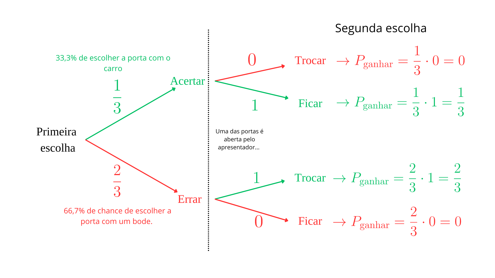

# O Problema do Apresentador: Uma Abordagem Estatística para o Problema de Monty Hall

## Sumário

  1. [Introdução](#introdução)
  2. [O problema](#o-problema)
  3. [Porque é melhor trocar de porta](#porque-é-melhor-trocar-de-porta)
  4. [Como o programa funciona](#como-o-programa-funciona)
  5. [Como recriar o experimento](#como-recriar-o-experimento)
  6. [Referências](#referências)

## Introdução

O problema de [Monty Hall](http://clubes.obmep.org.br/blog/probabilidades-o-problema-de-monty-hal/) envolve três portas, sendo que uma delas esconde um prêmio e as outras duas contém um bode. Uma pessoa (ou algum jogador) seleciona uma porta (que ainda não está aberta), e, logo após, outra porta (que não foi a escolhida) é aberta pelo apresentador e mostra que atrás desta havia um bode. Agora, restam duas portas fechadas (uma com o prêmio e outra com outro bode), sendo uma dessas a que o jogador escolheu. Então, depois dessa etapa, o jogador pode decidir se mantém a sua escolha inicial ou se troca de porta. A questão é: <strong> a melhor opção é ficar com a porta que escolheu no começo ou mudar para a outra porta que restou? </strong>


## O problema

Ao analisarmos os eventos possíveis, percebemos o seguinte: como a probabilidade de um evento ocorrer é dada pela razão dos casos favoráveis pelo total de casos, como o jogador que ganhar o prêmio e ele está em uma das três, temos 1 caso favorável (escolher a porta com o prêmio) e três casos totais (as três portas), logo, podemos concluir que temos 1/3 de chance de ganhar ao escolher uma porta aleatória.


Nesse sentido, o grande ponto do problema de Monty Hall é este: <strong> o apresentador deverá abrir uma das portas e revelar que nessa porta há um bode. </strong>


Por conseguinte, agora sabemos que uma das portas não tem nenhuma chance de ter o prêmio. Ou seja, é intuitivo pensar que agora cada uma das duas portas restantes possuem 50% de chance de ter o prêmio. No entanto, no próximo tópicos será provado o porquê disso não ser verdade.  

## Porque é melhor trocar de porta

Como visto anteriormente, cada porta tem 1/3 de chance de ter o prêmio. No entanto, como apenas uma tem o prêmio, temos 1/3 de chance de acertar (uma porta certa) e 1/3 + 1/3 de chance de errar (duas portas com bodes), ou seja, 2/3 de chance de escolher uma porta com um bode. Logo, a explicação mais rapida é que, como temos mais chance de escolher uma porta errada (2/3 é o dobro de 1/3), é mais provável ganhar se trocar de porta.</br>

Observe, na imagem abaixo, a representação em um digrama de árvore das possibilidades.



## Como o programa funciona

Primeiramente, temos uma função que gera um identificador para as portas (escolhida, revelada e premiada). Essa função é implementada da seguinte maneira:

```python
 def gen_random_door(self) -> int:
        return random.randint(1, 3)
```

Em seguida, outra função, utilizando a função anterior, define valores para a porta escolhida pelo jogador e para a porta premiada:

```python
def monty_hall(self, trocar_porta: bool) -> bool:
  porta_premiada: int = self.gen_random_door()
  primeira_porta_escolhida: int = self.gen_random_door()
        
...
```

Após definir os valores da porta que deve ser escolhida pelo jogador e da porta que contém o prêmio, é definida a porta que é revelada pelo apresentador - note que essa não pode ser igual à porta que contém o prêmio ou a que foi escolhida pelo jogador:

```python
...
   porta_revelada: int = random.choice(
            list({1, 2, 3} - {porta_premiada, primeira_porta_escolhida})
        )
...
```

A função, então, checa se o jogador deve ou não trocar de porta. Se o usuário trocar, outra variável é criada ("segunda_porta_escolhida"), a qual não pode ser igual à primeira porta escolhia ou à porta revelada; depois verifica-se se o jogador escolheu a porta com premiada ou não. Se o jogador não trocar, verifica-se apenas se a porta escolhida foi a premiada (retorna True) ou não (retorna False):

```python
def monty_hall(self, trocar_porta: bool) -> bool:

...

    if trocar_porta:
            return ({1, 2, 3} - {porta_revelada, primeira_porta_escolhida}).pop() == porta_premiada
        else:
            return primeira_porta_escolhida == porta_premiada
...
```

Nesse momento é definida uma amostra pro experimento (quantidade de jogos/partidas):

```python
amostra = 1_000
```

> [!WARNING]
> Note que quanto maior a amostra mais tempo levará para rodar todos os casos.

Para salvar os dados, o programa cria uma tabela chamada "Ganhou" com três colunas: id (int), won_changing (int [0 ou 1]) won_not_changing(int [0 ou 1]). Exemplo em sql:

```sql
CREATE TABLE IF NOT EXISTS Game(
  id INTEGER PRIMARY KEY AUTOINCREMENT,
  won_changing INTEGER,
  won_not_changing INTEGER);     
```

Implementacão em python:

```python
...
class Database:

    def __init__(self, db_name: str) -> None:
        self.database_connection: sqlite3.Connection = sqlite3.connect(db_name)
        self.cursor: sqlite3.Cursor = self.database_connection.cursor()
        self.cursor.execute(
            """CREATE TABLE IF NOT EXISTS Game(
                                id INTEGER PRIMARY KEY AUTOINCREMENT,
                                won_changing INTEGER,
                                won_not_changing INTEGER
                            )"""
        )

    def insert_data(self, game: Game) -> None:
        self.cursor.execute(
            "INSERT INTO Game(won_changing, won_not_changing) VALUES (?, ?)",
            (game.won_changing, game.won_not_changing),
        )
        self.database_connection.commit()

    def get_all_games(self) -> list[tuple[int, int, int]]:
        result = self.cursor.execute("SELECT * FROM Game")
        return result.fetchall()

    def get_wins_changing(self) -> tuple[int, None]:
        result = self.cursor.execute("SELECT count(won_changing) FROM Game WHERE won_changing == 1")
        return result.fetchone()

    def get_wins_not_changing(self) -> tuple[int, None]:
        result = self.cursor.execute("SELECT count(won_not_changing) FROM Game WHERE won_not_changing == 1")
        return result.fetchone()

    def close_connection(self) -> None:
        self.database_connection.close()       
...
```

Por fim, o programa itera na quantidade de amostras, escrevendo cada uma das partidas no banco dedados e, no final, salvando as alterações:

```python

from data_analysis import plot
from database import Database, Game
from montyhallgame import MontyHallGame
from settings import amostra, db_name

...

db = Database(db_name)
mh = MontyHallGame()

for i in range(amostra):
    print(f"Iteration: {i}", end="\r")
    db.insert_data(Game(mh.monty_hall(True), mh.monty_hall(False)))

...

data = db.get_all_games()

db.close_connection()

plot(data, "barchart.png")

```

---

## Como recriar o experimento

WIP

---

## Referências

1. Paradoxo de Monty Hall. Universidade Federal do Rio Grande do Sul. Acesso em 23 de jun. de 2023. Disponível em: <https://www.ufrgs.br/wiki-r/index.php?title=Paradoxo_de_Monty_Hall>
2. Monty Hall Problem. Brilliant.org. Acesso em 25 de jun. de 2023. Disponível em: <https://brilliant.org/wiki/monty-hall-problem/>
3. Edward R. Scheinerman (2003). Matemática Discreta - Uma Introdução 1 ed. Brasil: Cengage Learning. 532 páginas. [ISBN](https://pt.wikipedia.org/wiki/International_Standard_Book_Number) 85-221-0291-0
4. Boechat, Gabriel. Simulação do problema de Monty Hall em R. Open Code Community. Acesso em 27 de jun. de 2023. Disponível em: <https://opencodecom.net/post/2021-04-25-simulacao-do-problema-de-monty-hall-em-r>
5. Probabilidades – O problema de Monty Hall. Acesso em 4 de set. de 2024. Disponível em: <http://clubes.obmep.org.br/blog/probabilidades-o-problema-de-monty-hal/>
